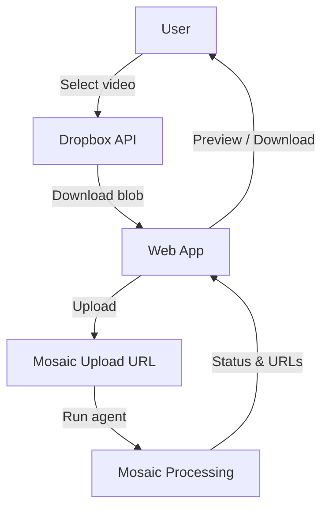
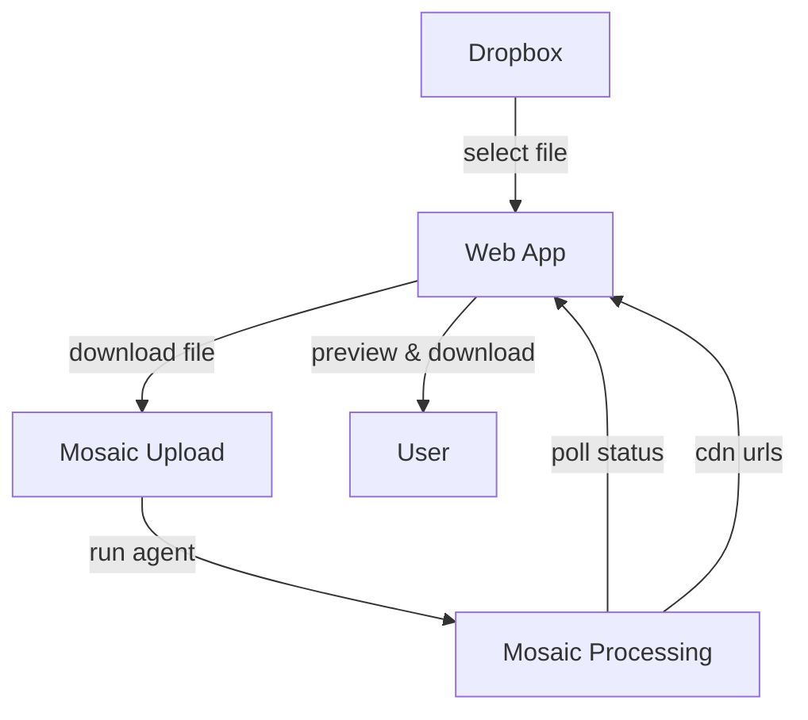

`create-shorts-post-to-socials/` is a React + Vite playground that lets you pick a video from **Dropbox**, process it with Mosaic, then download the finished short – no backend required.

[View source on GitHub](https://github.com/mosaic-ai-labs/api-examples/tree/main/create-shorts-post-to-socials)

## 1 · What it does



1. Lists Dropbox folders / files (filters video extensions)  
2. Uploads the selected file to Mosaic and runs an agent (Webinar, Talking-Head **or** free-form prompt)  
3. Polls run status every 5 s  
4. Shows `<video>` preview and download buttons for each output.

## 2 · Environment variables (`.env.local`)
```ini
# Mosaic
VITE_MOSAIC_API_KEY=sk_…
VITE_MOSAIC_API_BASE=https://api.usemosaic.ai/api
VITE_WEBINAR_AGENT_ID=uuid-…         # optional
VITE_TALKINGHEAD_AGENT_ID=uuid-…     # optional

# Dropbox
VITE_DROPBOX_ACCESS_TOKEN=sl.B…      # scope: files.content.read
VITE_DROPBOX_FOLDER=/Videos          # optional – defaults to root
```

## 3 · Install & run
```bash
cd create-shorts-post-to-socials
pnpm install          # or npm i
pnpm dev              # http://localhost:5173
# production
pnpm build && pnpm preview
```

## 4 · User workflow


## 5 · Customising
• Add real "post to socials" by wiring an OAuth token exchange after processing completes.  
• Extend agent list – fetch from your MCP server's `list_agents` tool or hard-code more IDs.  
• All UI components are shadcn – run `npx shadcn-ui@latest add button` to scaffold additional primitives. 