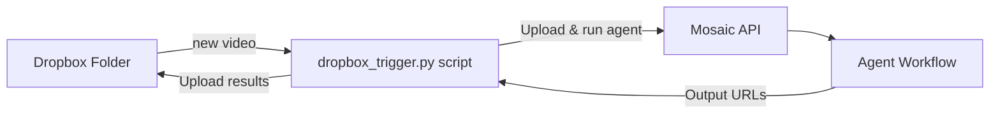

Need an automated assembly line for your Dropbox clips? This example script polls a folder, sends every fresh video to Mosaic, then uploads the processed output **back to the same Dropbox folder** with `-mosaic-output` appended to the file name.



## 1 · Prerequisites

| What | Where |
|------|-------|
| Mosaic API key (`mk_…`) | Dashboard → Developer → API Keys |
| Mosaic Agent ID | Dashboard → Agents |
| **Dropbox Access Token** | [Dropbox App Console](https://www.dropbox.com/developers/apps) – generate token |

Token must have `files.content.read/write` & `files.metadata.read/write` scopes and full-access.

Install deps:
```bash
pip install dropbox requests python-dotenv
```

Create a `.env` file:
```bash
MOSAIC_API_KEY=mk_xxxxxxxxxxxxxxxxx
MOSAIC_AGENT_ID=xxxxxxxx-xxxx-xxxx-xxxx-xxxxxxxxxxxx
DROPBOX_ACCESS_TOKEN=sl.ABxxxYYY
DROPBOX_FOLDER=/Videos      # optional – defaults to root
POLL_SECONDS=30             # optional
```

## 2 · Run
```bash
python dropbox_trigger.py          # loops forever
python dropbox_trigger.py --once   # single pass (cron friendly)
```

The edited video(s) will appear alongside the original as `video-mosaic-output.mp4` (or `_1`, `_2`, …).

## 3 · Copy / Reuse

Just copy `dropbox_trigger.py`, `README.md`, your `.env` and you have an instant Dropbox → Mosaic integration. ✨ 