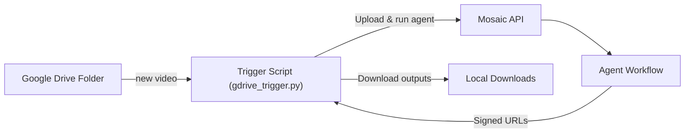

This example watches a single Google Drive folder and pipes **every new video** through a Mosaic agent – perfect for creators who dump raw clips into Drive.

[View source on GitHub](https://github.com/mosaic-ai-labs/api-examples/tree/main/gdrive-trigger)



## Features

* Poll Google Drive every `N` seconds (default 60)
* Downloads unseen video files
* Uploads to Mosaic, runs your agent with `auto=true`
* Saves outputs locally under `./downloads/<video-name>/`

<Note type="tip">The script is ~250 lines of vanilla Python – no frameworks, easily hackable.</Note>

## 1 · Prerequisites

| What | Where |
|------|-------|
| Mosaic API key (`mk_…`) | Dashboard → Developer → API Keys |
| Mosaic Agent ID | Dashboard → Agents (copy UUID in the "edit agent" page in the URL bar) |
| Google **Service Account** JSON | Google Cloud Console → IAM & Admin → Service Accounts → download JSON |

Share your Drive folder with the service-account's email so it can see the files.

Install deps:
```bash
pip install google-api-python-client google-auth requests python-dotenv
```

Create a `.env` file:
```bash
MOSAIC_API_KEY=mk_xxxxxxxxxxxxxxxxx
MOSAIC_AGENT_ID=xxxxxxxx-xxxx-xxxx-xxxx-xxxxxxxxxxxx
GDRIVE_FOLDER_ID=xxxxxxxxxxxxxxxxxxxxxxxxxxxxxxxxx
POLL_SECONDS=30
```
Place your `service-account.json` next to the script (or set `GOOGLE_SERVICE_ACCOUNT=path.json`).

## 2 · Run
```bash
python gdrive_trigger.py          # loops forever
python gdrive_trigger.py --once   # single pass (for cron jobs)
```

Outputs appear in `./downloads/`.

## 3 · How it works (snippet)

```python:title=gdrive_trigger.py
# Poll folder → download → upload → run agent → download outputs
vids = list_new_videos(svc, FOLDER_ID, seen)
for v in vids:
    local = download_file(svc, v, Path(tmpdir))
    uuid  = upload_to_mosaic(local)
    run   = run_agent(uuid)
    if poll_until_done(run):
        download_outputs(run, out_dir)
```

## 4 · Copy / Reuse

This folder is self-contained – copy `gdrive_trigger.py`, `README.md`, your `.env` and `service-account.json` into any project and you have an instant Drive → Mosaic integration.

Enjoy ✨ 