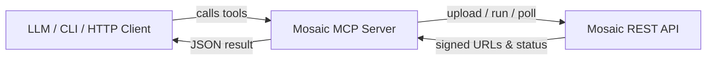

This example spins up a tiny server that turns Mosaic REST calls into **FastMCP tools** – perfect for ChatGPT function-calling or your own agents.



`mosaic-mcp/` is a **FastMCP 2.0** micro-service that exposes Mosaic helpers as callable tools – perfect for ChatGPT function-calling, custom agents, or simple HTTP usage.

[View source on GitHub](https://github.com/mosaic-ai-labs/api-examples/tree/main/mosaic-mcp)

## 1 · What it does

• Streams uploads directly to Mosaic (no local disk bloat)  
• Offers tools like `upload_video_from_local_file`, `create_or_run_agent`, `get_output_urls`  
• Transport-agnostic: run as **streamable HTTP** (default) or pure **stdio** for CLI embedding.

## 2 · Environment variables
```ini
MOSAIC_API_KEY=sk_…
MOSAIC_BASE_URL=https://api.usemosaic.ai/api
MAX_FILE_BYTES=5368709120   # 5 GiB cap
MCP_TRANSPORT=streamable-http  # or "stdio"
MCP_HOST=0.0.0.0
MCP_PORT=8000
```

## 3 · Install & run
```bash
cd mosaic-mcp     # folder in the api-examples repo
uv add fastmcp httpx python-dotenv python-magic-bin
uv run python main.py           # dev mode – http://localhost:8000/docs
```

### Container (Fly.io example)
```Dockerfile
FROM python:3.12-slim
WORKDIR /app
COPY mosaic-mcp /app/mosaic-mcp
RUN pip install --no-cache-dir fastmcp httpx python-dotenv python-magic-bin
ENV MCP_TRANSPORT=streamable-http MCP_HOST=0.0.0.0 MCP_PORT=8080
CMD ["python", "-m", "mosaic-mcp.main"]
```

## 4 · Tool reference
| Tool | Key args | Notes |
|------|----------|-------|
| `upload_video_from_local_file` | `file` bytes/path, `filename?` | Streams with 1 MiB chunks |
| `upload_video_from_url` | `url` | Size-checked download then upload |
| `create_or_run_agent` | `file_id`, **either** `agent` or `prompt`, `auto?` | If `prompt` present → agent_id `null` |
| `get_run_status` | `run_id` | `{status, progress}` |
| `get_output_urls` | `run_id` | Array of CDN links |
| `list_agents` | — | Returns curated `AGENTS` dict |

> The helper coroutines are **async**. When called over HTTP, FastMCP awaits them for you.

## 5 · Customising / extending

1. Add new helper – decorate an `async def` with `@mcp.tool`; FastMCP auto-docs it.  
2. Swap in your own `AGENTS` mapping (copy IDs from `GET /get-user-agents-simple`).  
3. Deploy multiple replicas – uploads go straight to Mosaic's storage so the service stays stateless. 