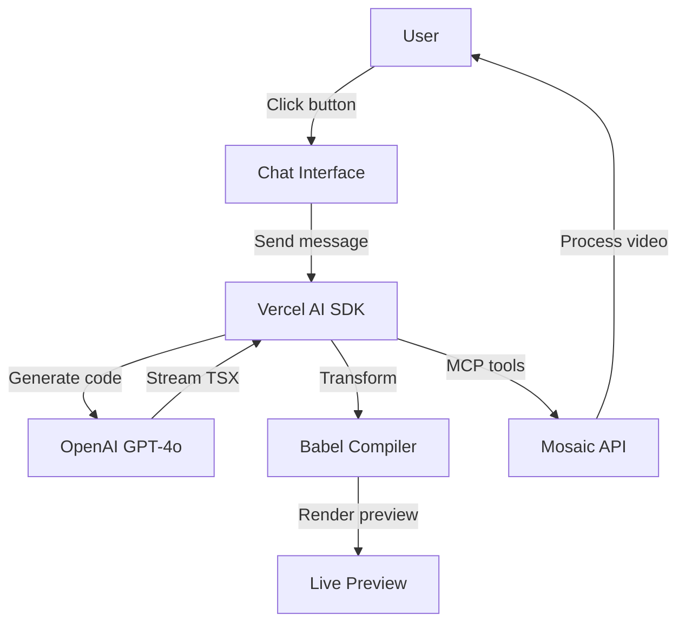
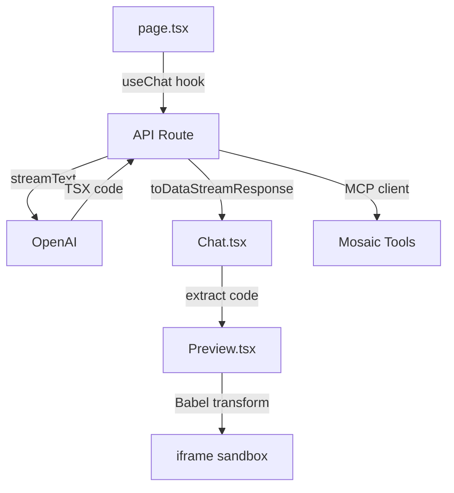

`vercel-ai-sdk-example/` is a Next.js playground that demonstrates the Vercel AI SDK's code generation capabilities combined with Mosaic's video editing tools through MCP integration.

[View source on GitHub](https://github.com/mosaic-ai-labs/api-examples/tree/main/vercel-ai-sdk-example)

## 1 · What it does



1. Auto-generates React components using GPT-4o via Vercel AI SDK
2. Live preview of generated TSX code with Babel transformation
3. Connects to Mosaic MCP server for video editing capabilities
4. Split-pane interface with chat on left, preview on right

## 2 · Environment variables (`.env.local`)
```ini
# OpenAI
OPENAI_API_KEY=sk_…

# Mosaic
MOSAIC_API_KEY=mk_…
```

## 3 · Install & run
```bash
cd vercel-ai-sdk-example
pnpm install
pnpm dev              # http://localhost:3000
```

## 4 · Technical flow


## 5 · Key features

• **Real-time generation** – Watch React components materialize as AI streams the code  
• **Live preview** – Instant visual feedback with Babel in-browser compilation  
• **MCP integration** – Native `experimental_createMCPClient` for Mosaic tool access  
• **Error handling** – Graceful compilation & runtime error display  
• **Button-driven UX** – Pre-configured prompts eliminate typing

## 6 · Customising

• Modify system prompt in `/api/chat/route.ts` to change generation style  
• Add new button flows in `page.tsx` with different demo scenarios  
• Extend Preview component to support external dependencies  
• Complete Mosaic MCP integration for full video editing workflow 